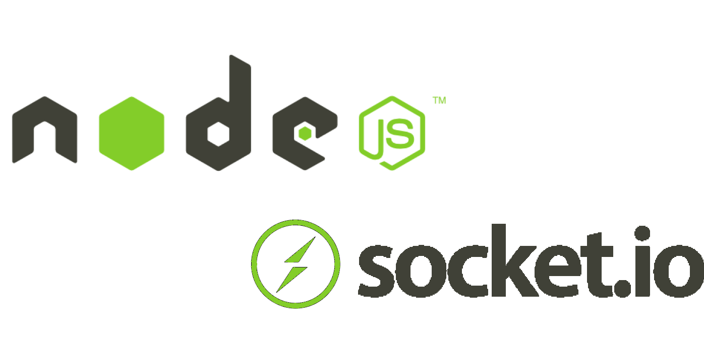
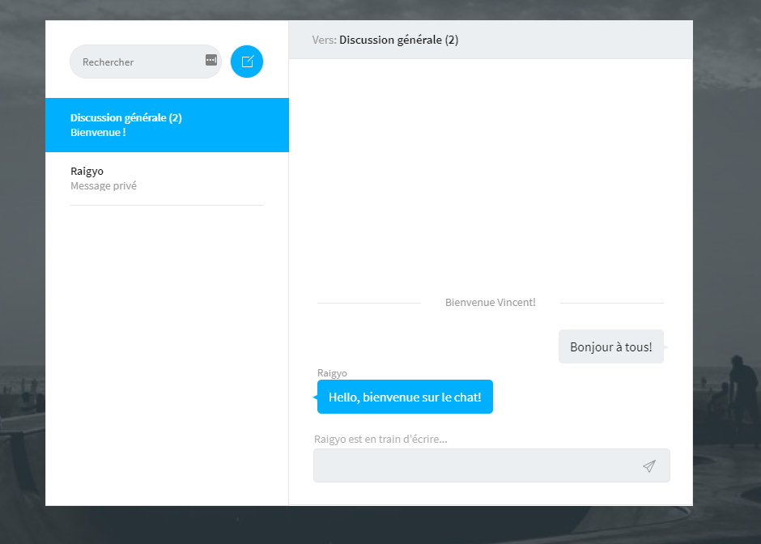
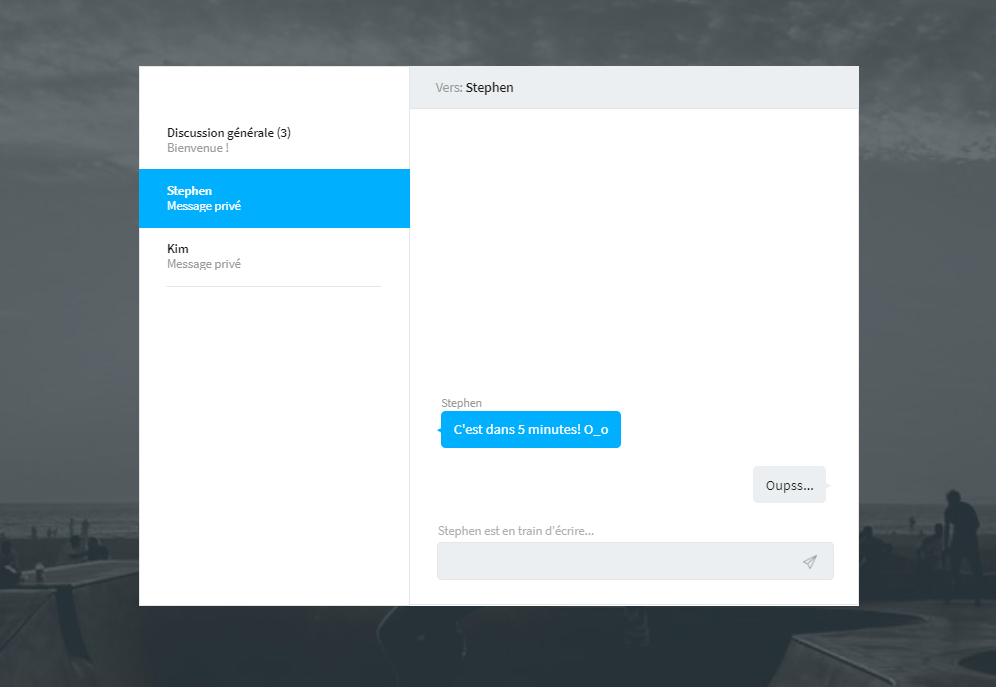

# NodeJS - Socket I/O - Chat

*February 2021*

> 🔨 Chat application using SocketIO. From udemy '[Socket.IO : Créer une discussion instantanée de A à Z](https://www.udemy.com/course/socketio/)'.



Demo on [Heroku](https://raigyo-socket-chat.herokuapp.com/)





## About

Chat application using SocketIO.

- Connexion in main room (Public discussion) with user name.
- The main chat windows displays also when a user connects or disconnects, and lists of all the connected people.
- Everybody who's connected has is own room so users can send private messages.
- A message is displayed when someone is writing but only if the user is in the same room.


## Local version

- Use the local [version branch](https://github.com/Raigyo/node-socket-io-chat/tree/local-version)
- `npm install`
- `npm run start` || `nodemon app.js`

## Dependancies

[socket.io](https://www.npmjs.com/package/socket.io): Socket.IO enables real-time bidirectional event-based communication.

`npm i socket.io`

**Server side**

````js
const app = require('express')();
const http = require('http').Server(app);
const io = require('socket.io')(http);

app.get('/', (req, res) => {
  res.sendFile(__dirname + '/index.html');
});

io.on("connection", (socket) => {
  // socket.emit('request', /* … */); // emit an event to the socket
  // io.emit('broadcast', /* … */); // emit an event to all connected sockets
  // socket.on('reply', () => { /* … */ }); // listen to the event
  console.log("User connected");
  socket.on("disconnect", () => {
    console.log("User disconnected");
  });
});

http.listen(3000, () => {
  console.log('listening on *:3000');
});
````

**Client side**

````html
<!-- /socket.io/socket.io.js is generated by socket IO -->
<script src="/socket.io/socket.io.js"></script>
<script>
  var socket = io(); // link between client and server
</script>
````

[striptags](https://www.npmjs.com/package/striptags): Strip HTML tags from a string.

`npm i striptags`

## Dev Dependancies

[nodemon](https://www.npmjs.com/package/nodemon): nodemon is a tool that helps develop node.js based applications by automatically restarting the node application when file changes in the directory are detected.

`npm i --save-dev nodemon`

[morgan](https://www.npmjs.com/package/morgan): HTTP request logger middleware for node.js

`npm i --save-dev morgan`

## Useful links
- [Express](https://expressjs.com/)
- [SOCKET.IO](https://socket.io/)
- [element.insertAdjacentHTML]https://developer.mozilla.org/fr/docs/Web/API/Element/insertAdjacentHTML)